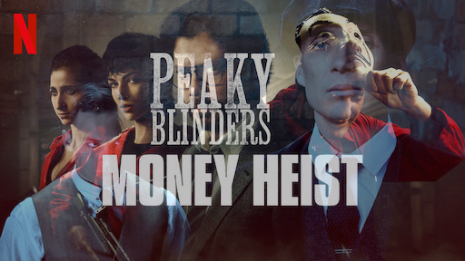
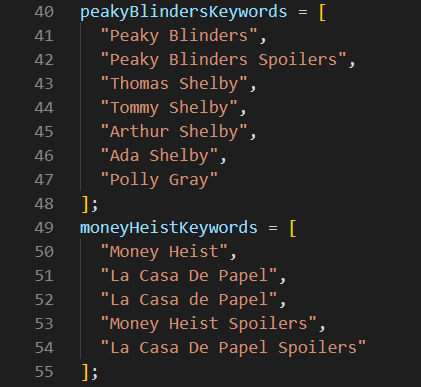
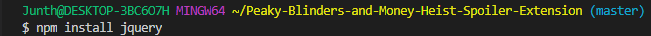
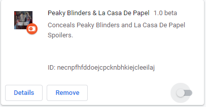
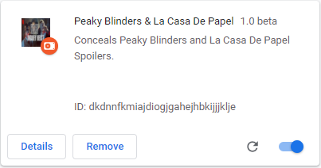

[](https://www.youtube.com/watch?v=Tl_2dK9jfvU) 
# Peaky Blinders and La Casa De Papel Spoiler Extension 
<p align="center">
  
</p>
<p align="center">
  <strong>Junth Basnet</strong>
</p>

---
**Peaky Blinders and La Casa De Papel (Money Heist) Spoiler Chrome Extension** saves you from Peaky Blinders and Money Heist spoilers while browsing internet.

<p align="center">
  
</p>

**Keywords Used to filter the content:**
<p align="center">
  
</p>

# Installation Dependencies and How to run?
``` js
1. Clone this repository: git clone https://github.com/Junth19/Peaky-Blinders-and-Money-Heist-Spoiler-Extension.git
2. cd Peaky-Blinders-and-Money-Heist-Spoiler-Extension.
3. npm install jquery and update jquery.min.js path in manifest.json.
```
<p align="center">
  
</p>
<p align="center">
  
</p>

``` js
4. Open Google Chrome and go to chrome://extensions.
5. Enable Developer mode.
6. Click on Load unpacked.
7. Select the path where you cloned this project.
8. Following icon appears besides Chrome Search Bar.
```
<p align="center">
  
</p>

``` js
9. Peaky Blinders and La Casa De Papel Extension is added to the Extensions.
```
<p align="center">
  
</p>

``` js
10. Enable Peaky Blinders and La Casa De Papel Extension.
```
<p align="center">
  
</p>

**Youtube Demo:** [Peaky Blinders and Money Heist Spoiler Concealer Chrome Extension.](https://www.youtube.com/watch?v=Tl_2dK9jfvU)
<h4 align="center">Enjoy Peaky Blinders and Money Heist Spoiler Concealer Chrome Extension.</h4>
<p align="center">
  <a href="https://www.youtube.com/watch?v=Tl_2dK9jfvU" target="_blank"></a>
</p>

# Liscense
MIT
